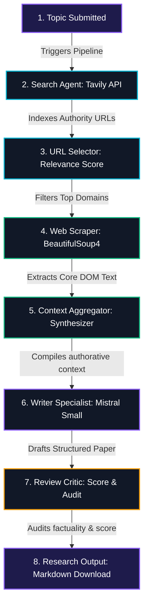

# 🪐 ResearchOS
### Multi-Agent Collaborative Scientific Analysis Suite

ResearchOS is a premium, full-stack collaborative multi-agent deep research and scientific synthesis suite. Powered by **FastAPI** on the backend and **Vite + React** on the frontend, it features a real-time Server-Sent Events (SSE) streaming execution engine, interactive telemetry system diagnostics, and a gorgeous n8n-style **Agentic Workflow Canvas** with moving neon data packets.

---

## ⚡ Tech Stack & Architecture

*   **Backend Core**: Python 3.11+, FastAPI (high-performance event streaming), LangChain (Agentic execution frameworks), Uvicorn (concurrent ASGI execution).
*   **Frontend Core**: React 19, Vite (blazing fast HMR module reloading), Lucide React (premium vector icons).
*   **Agents & Models**: LangChain Agents with `mistral-small` via the **Langchain Mistral AI** client.
*   **Search Engine**: **Tavily Search API** (high-fidelity parallel scientific indexing).
*   **Scraper Engine**: **BeautifulSoup4** (DOM parsing, header strip, and text normalization).
*   **Styling System**: Glassmorphism textures, animated visual flows, deep HSL spaces, and layout micro-animations.

---

## 🌟 Key Highlights & Capabilities

### 🎨 1. Agentic Workflow Canvas (n8n-Style Diagram)
*   **Snaking Grid Visual Layout**: A beautiful grid canvas rendering the exact topological flow of agents (*Trigger ➔ Search ➔ URL Selector ➔ Web Scraper ➔ Context Aggregator ➔ Writer Specialist ➔ Review Critic ➔ Final Output*).
*   **Electrical Sockets (Ports)**: Sockets are rendered on card borders (`::before`/`::after` pseudo-elements), aligning dynamically with logical input and output directions (L-to-R for Row 1, R-to-L for Row 2, and vertical vertical bridge lines).
*   **Active Neon Data Streams**: Flows turn into glowing linear gradients when active, with moving neon "data packet" particles traveling along connection lines via CSS animations (`flowPacketRight`, `flowPacketLeft`, `flowPacketDown`).
*   **Interactive Node Navigation**: Clicking any completed grid node navigates the tabs directly to the corresponding logs or context!

### 🖥️ 2. Futuristic Telemetry Control Sidebar
*   **Command Bar Search**: Search input with a floating search icon on the left, active border transitions, and a premium mechanical keyboard shortcut badge (`↵ Enter`).
*   **Interactive Suggestion Badges**: Quick startBadges feature Lucide icon prefixes instead of standard emojis, configured with glassmorphic backdrops and sliding hover translations.
*   **Live UNIX stdout Console log**: Monospace terminal log console in the left sidebar that streams live agent stdout in glowing green/cyan text when the pipeline is executing.
*   **System Diagnostics Live Heartbeat**: Telemetry diagnostic cards with left accent stripes (themed colors: fuchsia for Model, amber for Temperature, cyan for Search, emerald for BS4) and pulsing heartbeat sensors.

### 📊 3. High-Fidelity Analysis Display
*   **Reading Statistics Header**: Research report tab with an metadata header displaying estimated **Reading Time** (e.g. `~3 min read`) and **Word Count** dynamically.
*   **Dynamic Score Indicator**: Peer Critic score radial progress dial and card border glow dynamically according to the tier of the score (Vibrant Emerald Green for excellent `score >= 7.5`, Amber/Orange for medium `5.5-7.5`, and soft crimson red for `< 5.5`).
*   **Utility Export modules**: Copy-to-clipboard and immediate Markdown file downloader.

---

## 🗺️ Multi-Agent logical Pipeline Architecture

The system utilizes specialized collaborative agents communicating progressively:



---

## 🛠️ Installation & Setup Guide

### 📂 Directory Structure Tree
```
Multi_Agent_AI_Research_System/
├── server.py              # FastAPI Web SSE Server
├── pipeline.py            # Async Generator Pipeline Engine
├── agents.py              # Agentic definitions & LangChain prompts
├── tools.py               # Tavily search & BeautifulSoup parser
├── requirements.txt       # Python backend dependencies
├── .env                   # Local credentials and API keys
├── .gitignore             # Root gitignore (Secrets ignored!)
└── frontend/              # Vite + React Frontend Dashboard
    ├── package.json       # Node package manager configurations
    ├── vite.config.js     # Hot reload configuration
    ├── index.html         # Main entry skeleton
    └── src/
        ├── App.jsx        # Telemetry UI & SSE Connection logic
        ├── App.css        # Neon pipelines, ports, & glassmorphism
        └── index.css      # Outfits fonts, variables, & tailwind fallbacks
```

---

### Step 1: Clone & Configure Backend

1. Navigate to the project root directory:
   ```bash
   cd Multi_Agent_AI_Research_System
   ```

2. Create a virtual environment:
   ```bash
   python3 -m venv .venv
   ```

3. Activate the virtual environment:
   *   **macOS / Linux**:
       ```bash
       source .venv/bin/activate
       ```
   *   **Windows**:
       ```bash
       .venv\Scripts\activate
       ```

4. Install python dependencies:
   ```bash
   pip install -r requirements.txt
   ```

5. Create your `.env` file at the root:
   ```bash
   touch .env
   ```

6. Configure your environment credentials in `.env`:
   ```env
   MISTRAL_API_KEY="your_mistral_api_key"
   TAVILY_API_KEY="your_tavily_api_key"
   ```
   *(Note: `.env` is untracked by Git for security.)*

7. Start the FastAPI backend server:
   ```bash
   python server.py
   ```
   The backend server will launch on: **[http://localhost:8000](http://localhost:8000)**

---

### Step 2: Configure & Start Frontend

1. Open a new terminal session, navigate to the `/frontend` directory:
   ```bash
   cd frontend
   ```

2. Install Node dependencies:
   ```bash
   npm install
   ```

3. Start the Vite React development server:
   ```bash
   npm run dev
   ```
   The React dashboard will launch on: **[http://localhost:5173](http://localhost:5173)**

---

## 🔍 How to Use
1. Open your browser and navigate to **[http://localhost:5173](http://localhost:5173)**.
2. If your `.env` contains valid credentials, the **Research Director** input is unlocked. Alternatively, you can click the **API Credentials** toggle in the header, input your key, and click **Verify Key** to save it locally.
3. Enter any deep research topic (or click one of the suggested Quick investigations chips).
4. Click **Initialize Pipeline** and watch:
   - The UNIX-styleStdout Monospace console terminal stream stdout logs in real-time.
   - Sockets and nodes illuminate in neon purple and green.
   - Data streams pulse along connection lines.
5. Once complete, click completed nodes to inspect their outputs, download your markdown paper, or audit evaluation scores!
